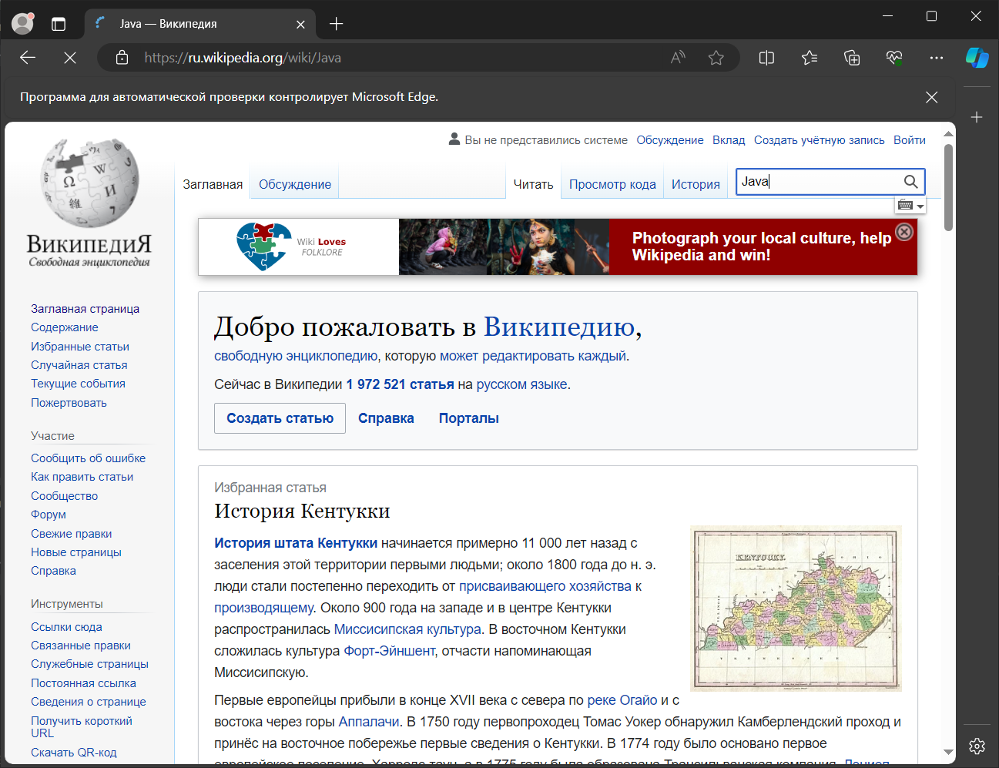
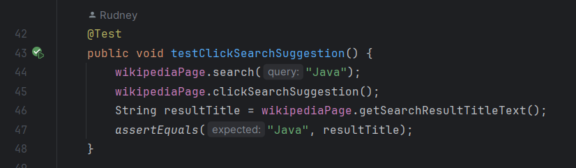
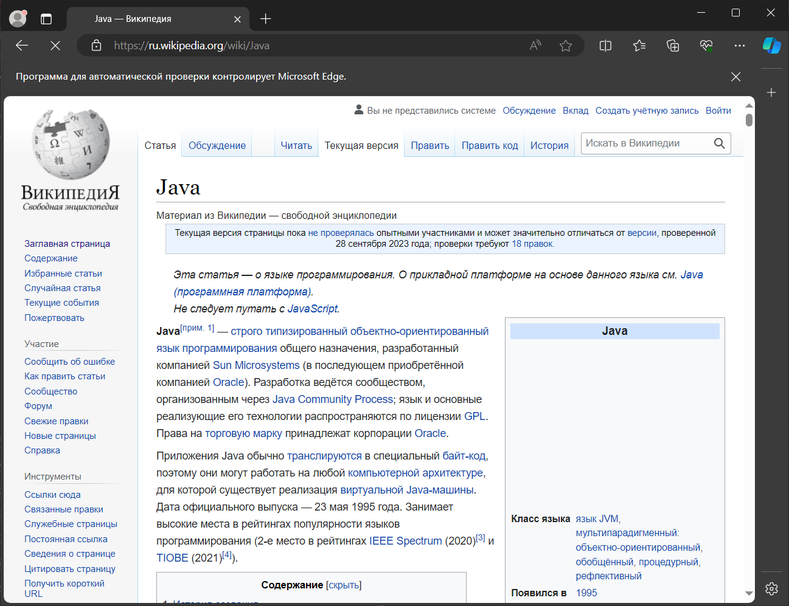
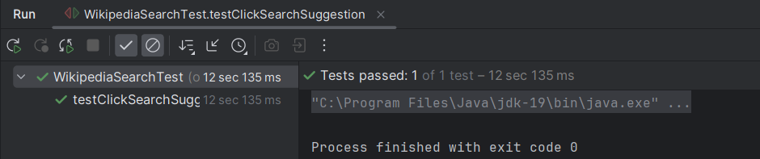
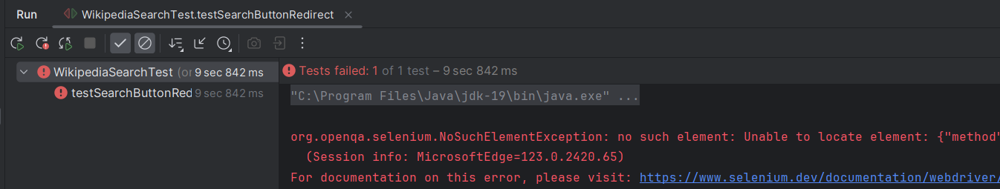

# Технотест Автотест

Привет! В этом репозитории хранится задач автотест.

Как это запустить?.

Нужно выполнить следующие действия:

1. Установите консольную версию Git, если не установлено
2. Склонировать этот репозиторий.
    ```shell
      git clone https://github.com/rudney5000/QA_Engineer-VK.git
    ```
3. Откройте терминал и перейдите в директорию используя команду.
    1. На **Linux**: `cd "путь/к папке QA_Engineer-VK"`
    2. На **Windows**: `cd "путь\к папке QA_Engineer-VK"`
4. Проверить корректность своего кода с помощью тестов.


## Как открыть проект в IDEA

После того, как вы склонировали репозиторий, откройте IDEA.
В IDEA нажмите меню `File → Open`. Выберите файл `pom.xml`, который находится в склонированном репозитории:

## Стуктура папок и файлов 

```
├── application/
│   ├── src/
│   │   ├── main/
│   │   │   ├── java/
│   │   │   │   └── org/qa/
│   │   │   │       ├── WikipediaPage.java
│   │   └── test/
│   │   │   ├── java/
│   │   │   │   └── org/qa/
│   │   │   │       ├── WikipediaSearchTest.java
│   └── pom.xml
`
```

Java класс - `Wikipedia.java`. Это главный класс нашего приложения Который задерживается нашими основными методами для задачи
## Тестирование кода

Для нашего проекта написаны тесты, Они хранятся в классе `WikipediaSearchTest.java`. С помощью тестов можно проверить, правильно ли вы реализовали тот или иной . Название теста соответствует названию метода в классе `WikipediaPage` с префиксом `test`. Например, для метода `clickSearchSuggestion` проверка корректности будет выполнятся в методе `testClickSearchSuggestion`.

Пока вам не нужно уметь самостоятельно реализовывать тесты, достаточно просто уметь их запускать.
Для того, чтобы это сделать, нужно перейти в класс `WikipediaSearchTest` и нажать зелёный треугольник возле метода с нужным названием. Тесты можно запускать в режиме исполнения или в режиме отладки:

`testSearchSuggestionStartsWithQuery()` он проверяет, что первый саджест начинается с введенного запроса с помощью метода `search()`, он позволяет ввести заданный поисковый запрос в поле ввода поиска на странице Wikipedia
метод `getSearchSuggestionText()` позволяет получить текст первой подсказки поиска, отображаемой на странице



метод `testSearchSuggestionClick()` представляет собой тестовый метод, который проверяет, что при клике на предложение поиска на странице Википедии результат соответствует ожиданиям.


метод `testSearchButtonRedirect()` представляет собой тестовый метод, который проверяет, что после нажатия на кнопку поиска на странице Википедии происходит корректный редирект.


Если после запуска тесты загорелись зелёным -- ура, вы справились!


Если тест падает, то сообщение будет выглядеть вот так:


Не забудьте поставить *breakpoint*-ы внутри нужного метода.

Можно запустить сразу все тесты. Для этого нужно нажать кнопку запуска не возле конкретного тестового метода, а возле имени класса `WikipediaSearchTest`.
